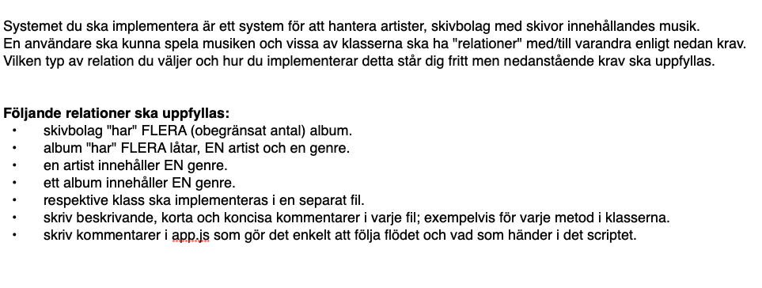
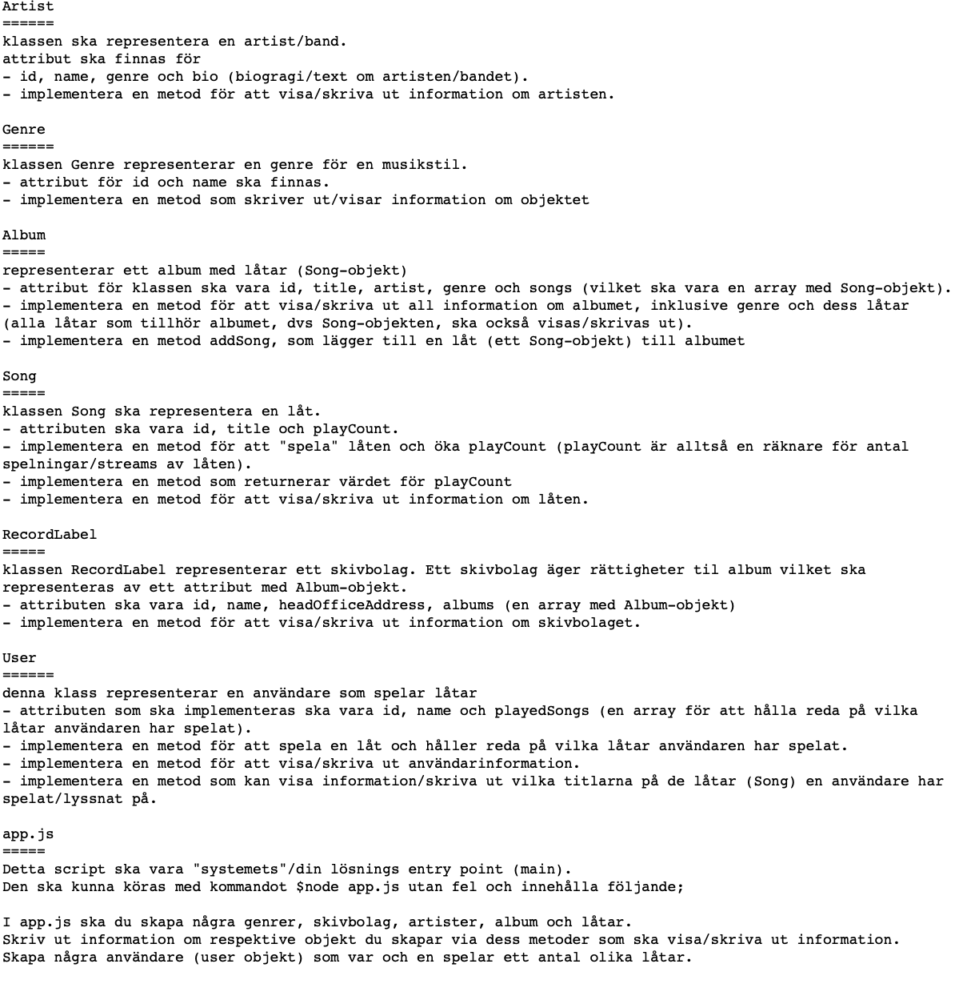

# Uppgift klasser och objekt - simulation av artister och skivbolag

## Syfte
Syftet med uppgiften är att du ska hantera klasser, relationer mellan klasser samt objekt/instanser av klasser.
Kortfattat så ska du implementera grunden för ett system som simulerar skivbolag med artister och musik. 
Det finns nu inget medföljande jest-test - du ska implementera din lösning enligt instruktioner och krav i den här uppgiften.
Du kommer att bedömas enligt kraven nedan samt på korrekt användning av klasser och objekt och övergripande funktionalitet. 
Bedömningen kommer också att ta hänsyn till struktur i din kod, inklusive indentering, namngivning och övergripande struktur.

## Krav

Implementera klasserna enligt nedan:

    

    
**Frivilligt**
Följande är inget krav, men för dig som redan har kunskaper och vill göra extra kan implementera nedanstående:

- Implementera möjligheten att lägga till nya genrer, skivbolag, artister, album och låtar i systemet.
- Vid körning av scriptet ska man kunna välja en genre och visa artister inom den genren.
- Vid körning av scriptet ska man kunnan välja en artist, visa dess album och låtar och låt användaren spela låtarna.        
- Implementera felhantering för ogiltiga inmatningar från användaren.
- Gör en webbapplikation med Express av din lösning. Gör 'sidor' och routes för ett låtbibliotek och möjlighet att spela låtar.
- Använd Spotifys API (om du har konto) för att skapa låtar, album etc med data ifrån Spotify.
- Implementera arv (inheritance) i din lösning. Exempelvis en superklass för en artist och subklasser för artister inom olika kategorier med specifika egenskapar.
T ex artister inom film, musik, teater etc.

**Tips**

Du kan läsa mer om klasser och t ex relationer bland övningarna https://github.com/node-programming-classroom-repos/excercises-nodejs/tree/main/08%20-%20classes
Börja i små steg - börja med att göra en klass och en metod. 
Testkör din lösning via app.js där du t ex skapar objekt och anroper klassen metoder. Om allt är ok, bygg vidare.
Självklart kan du skapa egna tester med t ex jest.

